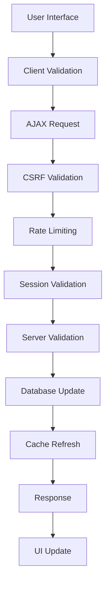

# Configuration Edit Implementation Plan

This document outlines the detailed implementation plan for adding configuration editing functionality to the SheetDB configuration management interface.

## Project Overview

**Objective**: Transform the read-only configuration management interface into a fully functional editing system with security, validation, and user experience enhancements.

**Duration**: Estimated 3-4 development cycles (12-16 hours)

**Priority**: High - Critical for administrative workflow improvements

## Implementation Phases

### Phase 1: Backend API Foundation (4-5 hours)

#### 1.1 Enhanced Security Utilities
**Files**: `src/utils/security.ts`
- Add rate limiting functionality
- Implement request throttling per session
- Add validation helpers for config values
- Enhance CSRF token management

**Deliverables**:
- Rate limiting middleware
- Enhanced security validation
- Unit tests for security utilities

#### 1.2 Configuration Schema Definition
**Files**: `src/utils/config-schema.ts` (new)
- Define configuration field metadata
- Validation rules and patterns
- Field dependencies and relationships
- Type definitions for all config fields

**Deliverables**:
- Complete configuration schema
- TypeScript type definitions
- Field validation logic

#### 1.3 Core API Endpoints
**Files**: 
- `src/api/v1/config/schema.ts` (new)
- `src/api/v1/config/update.ts` (new)
- `src/api/v1/config/validate.ts` (new)

**Schema Endpoint** (`GET /config/schema`):
- Returns field metadata and validation rules
- Includes type information and constraints
- Provides UI hints for rendering

**Update Endpoint** (`PUT /config/update`):
- Atomic batch updates with transaction support
- Comprehensive validation before database changes
- Rate limiting and CSRF protection
- Error handling with detailed feedback

**Validate Endpoint** (`POST /config/validate`):
- Real-time field validation
- Pattern matching and format checking
- Dependency validation
- Suggestions for invalid values

**Deliverables**:
- Three new API endpoints
- Request/response type definitions
- Comprehensive error handling
- API integration tests

### Phase 2: Frontend UI Implementation (4-5 hours)

#### 2.1 Enhanced Configuration Table
**Files**: `src/api/v1/config/get.ts`
- Add edit mode toggle functionality
- Implement dynamic input field generation
- Add validation status indicators
- Include reset and confirm buttons

**Key Features**:
- Mode switching (View ↔ Edit)
- Field type-specific input rendering
- Sensitive data masking and reveal
- Real-time validation feedback

#### 2.2 Client-side JavaScript
**Files**: `public/scripts/config-edit.js` (new)
- Edit mode state management
- Real-time validation with debouncing
- AJAX calls for validation and updates
- Modal dialogs for confirmations
- Error handling and user feedback

**Key Features**:
- Debounced validation (300ms delay)
- Change tracking and dirty state
- Batch save functionality
- Confirmation dialogs for sensitive changes

#### 2.3 Enhanced Styling
**Files**: Update existing CSS in `get.ts`
- Responsive design for mobile/tablet
- Accessibility improvements
- Visual feedback for validation states
- Modal and tooltip styling

**Deliverables**:
- Fully functional edit interface
- Client-side validation and feedback
- Mobile-responsive design
- Accessibility compliance

### Phase 3: Advanced Features (3-4 hours)

#### 3.1 Enhanced Validation System
**Files**: `src/utils/config-validation.ts` (new)
- Custom validation rules per field type
- Cross-field dependency validation
- External service connectivity checks
- Business logic validation

**Validation Types**:
- Google OAuth credential validation
- Auth0 domain and credential checks
- Storage service connectivity
- URL format and reachability
- Token format validation

#### 3.2 User Experience Enhancements
**Files**: Various UI files
- Search and filter functionality
- Category-based organization
- Bulk operations (reset, validate)
- Session timeout warnings
- Auto-save with conflict resolution

#### 3.3 Error Recovery and Resilience
**Files**: Multiple
- Network error handling
- Retry mechanisms for failed requests
- Graceful degradation for JavaScript failures
- Data loss prevention

**Deliverables**:
- Advanced validation system
- Enhanced user experience features
- Robust error handling
- Performance optimizations

### Phase 4: Testing and Documentation (2-3 hours)

#### 4.1 Comprehensive Testing
**Files**: `test/api/v1/config/` directory
- Unit tests for all new endpoints
- Integration tests for edit workflows
- Security testing for CSRF and validation
- Performance testing for rate limiting
- UI testing for form interactions

**Test Coverage Goals**:
- 95%+ code coverage for new functionality
- Security vulnerability testing
- Cross-browser compatibility testing
- Mobile device testing

#### 4.2 Documentation Updates
**Files**: Documentation files
- API documentation updates
- User guide for configuration editing
- Security guidelines for administrators
- Troubleshooting guide

**Deliverables**:
- Complete test suite
- Updated documentation
- Deployment guide
- Security audit report

## Technical Architecture

### Data Flow



### Security Layers

1. **Transport Security**: HTTPS required
2. **Session Security**: HMAC-signed tokens
3. **Request Security**: CSRF protection
4. **Rate Limiting**: Per-session throttling
5. **Input Validation**: Client and server-side
6. **Database Security**: Parameterized queries via ORM
7. **Output Security**: Data sanitization

### Performance Considerations

#### Client-side Optimizations
- Debounced validation requests (300ms)
- Cached validation results
- Minimal DOM updates
- Lazy loading for large configuration sets

#### Server-side Optimizations
- Connection pooling for database
- Validation caching
- Batch operation support
- Efficient rate limiting algorithms

## File Structure Changes

```
src/
├── api/v1/config/
│   ├── get.ts           # Enhanced with edit mode
│   ├── auth.ts          # Existing (no changes)
│   ├── logout.ts        # Existing (no changes)
│   ├── schema.ts        # New: Configuration schema
│   ├── update.ts        # New: Update configurations
│   ├── validate.ts      # New: Validate fields
│   └── index.ts         # Updated routes
├── utils/
│   ├── security.ts      # Enhanced with rate limiting
│   ├── config-schema.ts # New: Schema definitions
│   └── config-validation.ts # New: Validation logic
└── types/
    └── config.d.ts      # Enhanced type definitions

test/api/v1/config/
├── config.test.ts       # Enhanced existing tests
├── schema.test.ts       # New: Schema endpoint tests
├── update.test.ts       # New: Update endpoint tests
├── validate.test.ts     # New: Validate endpoint tests
└── integration.test.ts  # New: Full workflow tests

public/scripts/
└── config-edit.js       # New: Client-side functionality

docs/
├── config-edit-functionality.md     # This document
├── config-edit-api.md              # API specification
├── config-edit-ui-spec.md          # UI specification
└── config-edit-implementation-plan.md # This document
```

## Risk Assessment

### High Risk Items
1. **Data Loss**: Incorrect updates could break system configuration
   - **Mitigation**: Atomic transactions, validation, confirmation dialogs
   
2. **Security Vulnerabilities**: Authentication bypass or injection attacks
   - **Mitigation**: Comprehensive security testing, CSRF protection, input validation
   
3. **Performance Issues**: Rate limiting could impact user experience
   - **Mitigation**: Generous rate limits, clear feedback, retry mechanisms

### Medium Risk Items
1. **UI Complexity**: Complex interface could confuse users
   - **Mitigation**: Progressive disclosure, clear labeling, help text
   
2. **Browser Compatibility**: JavaScript features may not work on older browsers
   - **Mitigation**: Graceful degradation, polyfills, feature detection

### Low Risk Items
1. **Validation Accuracy**: False positives/negatives in validation
   - **Mitigation**: Comprehensive testing, user feedback mechanisms

## Success Criteria

### Functionality
- [ ] All configuration values can be edited through the web interface
- [ ] Real-time validation provides immediate feedback
- [ ] Sensitive fields require explicit confirmation
- [ ] Batch updates work atomically
- [ ] Rate limiting prevents abuse

### Security
- [ ] CSRF protection on all modification endpoints
- [ ] Session validation for all operations
- [ ] Input sanitization prevents XSS
- [ ] Sensitive data remains protected
- [ ] Rate limiting prevents brute force

### User Experience
- [ ] Intuitive edit mode toggle
- [ ] Clear validation feedback
- [ ] Mobile-responsive design
- [ ] Accessible to screen readers
- [ ] Performance acceptable on slow connections

### Technical
- [ ] 95%+ test coverage
- [ ] No performance regressions
- [ ] Backward compatibility maintained
- [ ] Documentation complete and accurate

## Deployment Strategy

### Development Environment
1. Feature branch creation
2. Incremental development with frequent commits
3. Local testing with each change
4. Integration testing before phase completion

### Staging Environment
1. Deploy after each phase completion
2. Manual testing of all workflows
3. Performance testing under load
4. Security scanning and penetration testing

### Production Deployment
1. Blue-green deployment strategy
2. Gradual rollout with monitoring
3. Rollback plan ready
4. User communication about new features

## Monitoring and Metrics

### Application Metrics
- Configuration update frequency
- Validation failure rates
- Rate limiting trigger frequency
- Session timeout rates
- Error rates by endpoint

### User Experience Metrics
- Edit mode usage statistics
- Time spent in edit mode
- Abandonment rates during editing
- User feedback and support tickets

### Security Metrics
- CSRF attack attempts
- Rate limiting violations
- Authentication failures
- Suspicious activity patterns

## Future Enhancements

### Phase 5: Advanced Features (Future)
- Configuration history and audit trail
- Bulk import/export functionality
- Configuration templates
- Advanced user role management
- API endpoint for programmatic updates

### Phase 6: Enterprise Features (Future)
- Multi-tenant configuration isolation
- Advanced approval workflows
- Integration with external secret management
- Advanced monitoring and alerting
- Configuration drift detection

This implementation plan provides a comprehensive roadmap for delivering secure, user-friendly configuration editing functionality while maintaining the high security and reliability standards of the existing system.